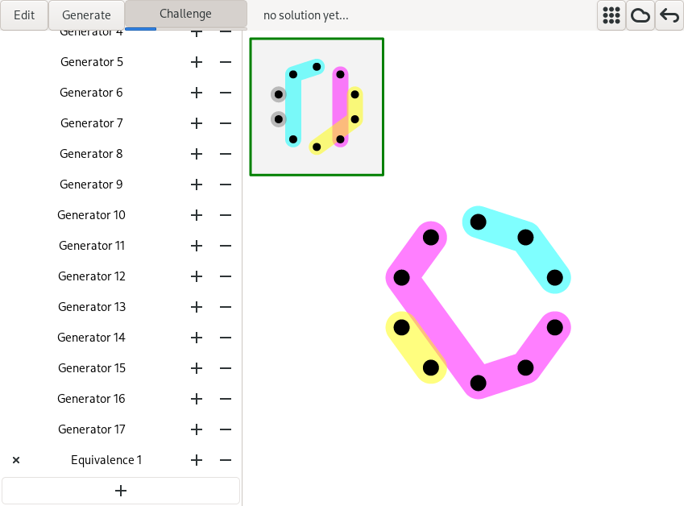

# Equivalence game

This is a toy for playing with the following math problem: Given a finite set X, construct G -- as small as possible set of equivalence relations on X such that any other equivalence relation on X can be generated from G using the lattice operations: intersection (refinement), and join (transitive closure of union)

Run:
```
./equiv_game.py
```



## Dependencies
+ Python3
+ [pyGtk3](https://pygobject.readthedocs.io/en/latest/getting_started.html)
+ [numpy](https://pypi.org/project/numpy/) (on Windows: "pacman -S mingw-w64-x86_64-python3-numpy")

## Using

* Left mouse button -- glue elements together / (or join in generate mode)
* Right mouse button -- separate elements / (or meet in generate mode)
* Middle mouse button / wheel -- move points / the view
* Escape -- quit the application
* For buttons in the app, see a description and keyboard shortcut by howerrving over them
* Run `./equiv_game --help` to see command line arguments

## Acknowledgement

I would like to thank Marcin Kozik for showing me this particular playful problem.
